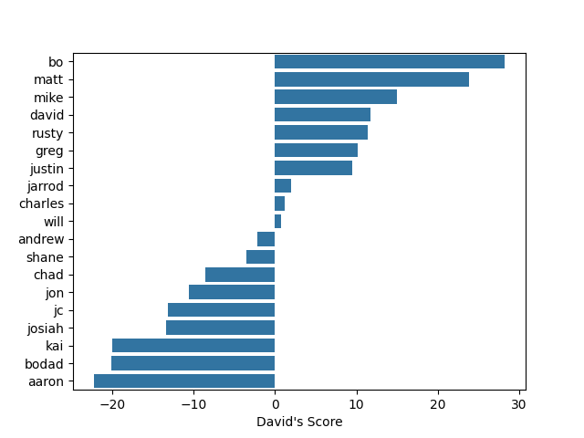

# Fantasy football chatbot

<!--  -->

<!--  -->

## Introduction

I've been in a fantasy football league for 15 odds years now. I care a lot about the league and the people in it. We've been through a lot together. 

Something I've noticed is that engagement ebbs and flows. We've had a total of 19 friends in the league, but a few dropped out after only a season or two. I always wondered if having a way to quickly access insights from historical data would be a way to increase league engagement. 

thought it would be interesting to have a way to access our league history quickly and easily. 

idea is to develop a fantasy football app
AI powered? haha. maybe.
add rankings integration from whatever sources you want (fantasy pros, etc.)
streamlit? not sure where I would host it..
dominance metrics (head-to-head, like they do in college football)
top 6 teams go to playoffs
pull stats from...?

Feel free to try the webapp out here- [https://fantasy-football-chat-wrmr8ksupfsmeutxb732rb.streamlit.app](https://fantasy-football-chat-wrmr8ksupfsmeutxb732rb.streamlit.app)

## Terminology

There are a bunch of terms in the fantasy football world that need to be defined before we get into the details.

1. league - This is a group of managers
2. manager - This is a person that picks players to be on a team
3. player - An NFL player that gains points for a manager in a given week
4. roster - A set of players on a given week
5. team - A group of rosters throughtout a season associated with a given manager. The team name can vary week-to-week. 
6. statistic - A number that describes an NFL metric (yards gained, touchdown scored, etc.)
7. week - A week in an NFL season
8. season - A set of managers playing together in a given year

## Challenges with sports data

<!-- talk about database normalization maybe (1NF, 2NF, 3NF compliant) -->

In early 2000, Yahoo allowed managers to drop players immediately after they played a game. Since yahoo doesn't provide the timestamp for when a player played on a roster in a given week, I had to use the end of the NFL week as the timestamp. This ensured that the player would not be dropped _before_ playing that week. However, in cases where a manager dropped the player earlier in the week, the events table would say that the player was only active the week before. So, to deal with this challenge, I wrote a function in python that scans through the events table and adjusts the drop time to the first minute of the following week. This way, if a player is active, he will show up that way for the given week and then be dropped for the following week.

## Optimizing database structure

I used a combination of SQLalchemy and PostgreSQL to build the database. We have three tables that have to do with players and managers: `rosters`, `transactions`, and `drafts`. One challenge I faced was how to efficiently store all the data.

The `rosters` table contains information about the roster, or the set of NFL players on a given person's team in a given week. You can imagine that sometimes a manager will leave a player in an active position all year. In that case, we would be recording data for each week (say, 16 weeks) when really all we need is 1 data point.

A better idea is to look at transitions between states (for example, between an active roster spot and a bench spot). This is stored in a table called `events`. Doing this results in a __31% reduction in storage__, although the SQL queries are more challenging to write given the dynamic nature of the `events` table. A benefit of this approach is that I can easily calculate time-dependent features like like "roster turnover" as the amount of time a player has been in a position.

Here is a graph of the different types of events (actives, drops, adds, inactives, drafts, and trades) as time series plot:

## Prompt engineering

I wanted to connect my database to a LLM so that we could ask some interesting questions. For example:
1. What are some sample trades I could make?
2. Who is the best of all time?
3. Who makes the most trades?
4. Show me a graph of points.
5. How often does the person with the most points win it all?

I might want to connect an LLM to SQL database. I did this using langchain.

The first version worked ok, but the chatbot often misunderstood the question I was asking and either failed to return anything or hallucinated and gave a ridiculous answer (e.g., shane won 900 games in a season.. which is impossible).

To solve this problem, I decided to create SQL views that have summarized data and more accessible names (with fewer many-to-many relationships). For example, I created a `slots` view that has NFL players on a given manager's roster for each week and year. I also created a `standings` view that has the records for each manager in each year. By only providing these views and the context of the column names, I was able to greatly improve the accuracy of the AI.

## Understanding league engagement

Possible metrics that could be useful in understanding manager engagement are roster turnover (the xx) and the overall number of moves (or transactions) made by a player.

## Bringing primate dominance hierarchies to fantasy football

Below is a matrix showing the overall number of times a team beat another team. For example, if we look at "shane" we see that he beat bo 10 times but only beat chad 7 times. By contrast, chad beat shane 9 times. So his record against shane is 9-7. Pretty cool!

We can go a step further and borrow from the scientific literature on folks that study primate social structures and dominance. A useful metric is the "David's Score." Someone who wins a lot of games against winless teams would have a lower David's score than someone who wins a lot of games against teams that beat other teams a lot. Here's a plot that shows overall "dominance" (i.e., David's score) for each time across the 17 yearas the league has been in existence.

## References

What others have done
https://introductory.medium.com/fantasy-football-stats-gpt-fb92c1006f92

Useful for setting up db, llm
https://medium.com/dataherald/how-to-langchain-sqlchain-c7342dd41614

